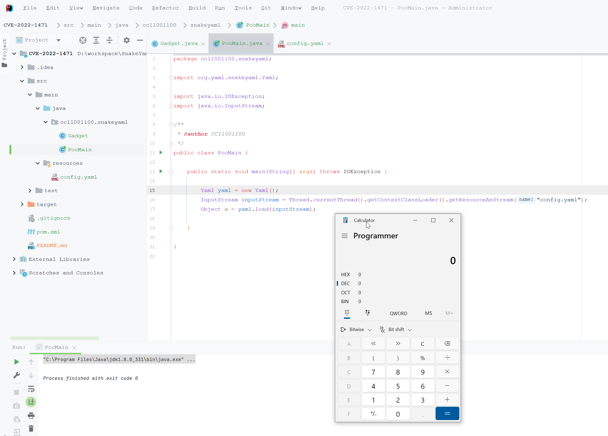

# SnakeYaml Constructor Deserialization Remote Code Execution (CVE-2022-1471)

成功弹出计算器：

# 参考资料

- https://github.com/google/security-research/security/advisories/GHSA-mjmj-j48q-9wg2

- https://osv.dev/vulnerability/GHSA-mjmj-j48q-9wg2
- https://bitbucket.org/snakeyaml/snakeyaml/issues/561/cve-2022-1471-vulnerability-in#comment-64876314

