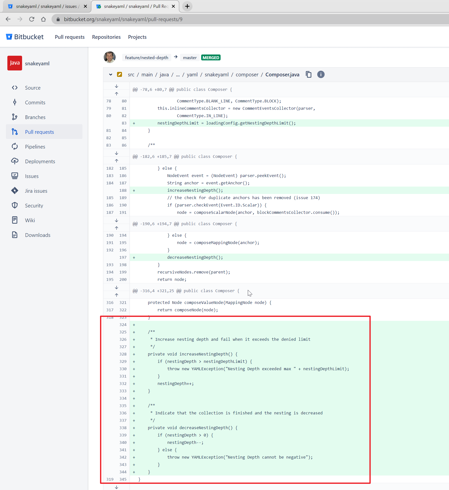

# Uncontrolled Resource Consumption in snakeyaml (CVE-2022-25857)


反序列化的时候没有限制深度，导致可以DoS


查看修复此漏洞的PR： 

```text
https://bitbucket.org/snakeyaml/snakeyaml/pull-requests/9
```

单看commit看不太清楚，只能大概看到是增加了一个深度计数器，进入新的一层时检查深度，但是对整体是如何运行的并不是能看得很清楚，我们跟进去代码对整体大概过一下。




# 参考资料

- https://github.com/advisories/GHSA-3mc7-4q67-w48m

- https://osv.dev/vulnerability/GHSA-3mc7-4q67-w48m
- https://nvd.nist.gov/vuln/detail/CVE-2022-25857
- https://github.com/snakeyaml/snakeyaml/commit/fc300780da21f4bb92c148bc90257201220cf174


